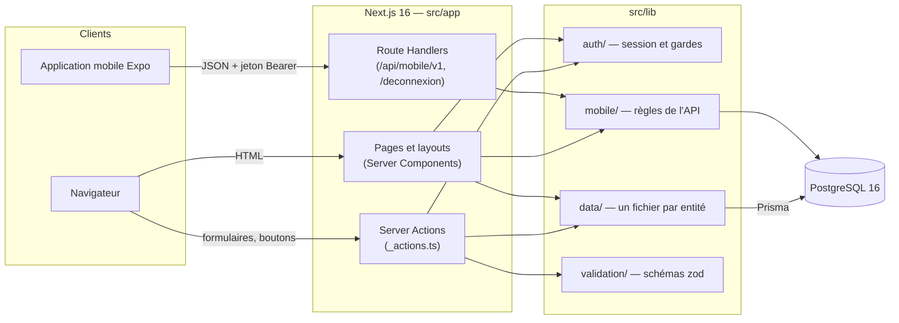

# Architecture

Ce document explique comment le projet est organisé : les groupes de routes, les
layouts, les dossiers, et le chemin que suit une requête. Il correspond à la
ligne « Architecture App Router & organisation » du barème.

Documents liés : [rendu, données et mutations](choix-de-rendu.md) ·
[base de données](base-de-donnees.md) ·
[authentification et sécurité](authentification-et-securite.md).

## Vue d'ensemble

Repère est une seule application Next.js 16 (App Router). Elle sert trois
publics : le visiteur (site public), le membre et l'administrateur (espace
connecté), et l'application mobile (API JSON). Il n'y a pas de serveur Node
séparé : tout le backend vit dans Next.js et parle à PostgreSQL par Prisma.



## Les groupes de routes

J'ai découpé `src/app` en quatre groupes de routes. Un groupe (un dossier entre
parenthèses) n'apparaît pas dans l'URL : il sert à donner un layout et une règle
d'accès à un ensemble de pages.

| Groupe         | Rôle                                      | Layout                                     | Accès (vérifié sur le serveur)                       |
| -------------- | ----------------------------------------- | ------------------------------------------ | ---------------------------------------------------- |
| `(marketing)`  | Site public, indexable                    | En-tête et pied de page du site            | Ouvert à tous                                        |
| `(auth)`       | Entrée dans le produit                    | Page centrée, logo, choix de la langue     | Ouvert à tous                                        |
| `(onboarding)` | Profil à compléter après l'inscription    | Page centrée, logo                         | Connecté, onboarding **non** terminé (`requireUser`) |
| `(app)`        | Espace membre **et** back-office `/admin` | Barre latérale (ou onglets sur mobile)     | Connecté et onboarding terminé (`requireOnboarded`)  |
| `(app)/admin`  | Back-office                               | Layout imbriqué : onglets d'administration | Rôle `admin` (`requireAdmin`)                        |

### Pourquoi l'administration est sous `(app)` et pas dans un groupe `(admin)`

Le sujet propose un groupe `(admin)` séparé, en précisant que les noms peuvent
être adaptés tant que les responsabilités restent séparées. J'ai placé
l'administration dans `src/app/(app)/admin/` pour une raison d'usage : un
administrateur est aussi un membre, et je voulais qu'il garde **le même menu
persistant** au lieu de basculer entre deux interfaces.

La séparation des responsabilités est assurée autrement :

- toutes les URL d'administration commencent par `/admin` ;
- `src/app/(app)/admin/layout.tsx` est un **layout imbriqué** qui appelle
  `requireAdmin()` : un membre qui ouvre `/admin` est redirigé vers
  `/acces-refuse` avant tout rendu ;
- chaque page d'administration et chaque Server Action d'administration
  rappelle `requireAdmin()` (voir
  [authentification et sécurité](authentification-et-securite.md)).

## Les layouts imbriqués

```
src/app/layout.tsx                    html, polices, thème, toasts, lien d'évitement
├─ (marketing)/layout.tsx             en-tête + pied de page du site
├─ (auth)/layout.tsx                  cadre centré des formulaires
├─ (onboarding)/layout.tsx            garde « connecté, pas encore onboardé »
└─ (app)/layout.tsx                   garde « connecté et onboardé » + navigation
   ├─ parametres/layout.tsx           carte du compte + onglets Profil / Sécurité / Préférences
   └─ admin/layout.tsx                garde « admin » + onglets d'administration
```

Une page comme `/admin/lieux` traverse donc trois layouts : le layout racine,
celui de l'espace connecté, puis celui de l'administration.

## Toutes les routes

### Site public — `src/app/(marketing)`

| URL                | Fichier                    | Contenu                                                     |
| ------------------ | -------------------------- | ----------------------------------------------------------- |
| `/`                | `page.tsx`                 | Accueil : recherche, types d'espace, lieux, crédits         |
| `/lieux`           | `lieux/page.tsx`           | Liste des lieux, filtres par ville et type (`searchParams`) |
| `/lieux/[slug]`    | `lieux/[slug]/page.tsx`    | Détail d'un lieu (route dynamique, `notFound()`)            |
| `/tarifs`          | `tarifs/page.tsx`          | Système de crédits, prix lus en base                        |
| `/fonctionnalites` | `fonctionnalites/page.tsx` | Ce que le produit permet                                    |
| `/vision-mobile`   | `vision-mobile/page.tsx`   | Présentation de l'application mobile                        |
| `/faq`             | `faq/page.tsx`             | Questions fréquentes                                        |
| `/acces-refuse`    | `acces-refuse/page.tsx`    | Page d'arrivée d'un membre qui tente d'ouvrir `/admin`      |

### Authentification — `src/app/(auth)`

| URL            | Fichier                | Contenu                                    |
| -------------- | ---------------------- | ------------------------------------------ |
| `/connexion`   | `connexion/page.tsx`   | Formulaire de connexion, comptes de démo   |
| `/inscription` | `inscription/page.tsx` | Création de compte                         |
| `/deconnexion` | `deconnexion/route.ts` | Route Handler `POST` : supprime la session |

### Onboarding — `src/app/(onboarding)`

| URL          | Fichier              | Contenu                                                      |
| ------------ | -------------------- | ------------------------------------------------------------ |
| `/bienvenue` | `bienvenue/page.tsx` | Écran d'accueil après l'inscription                          |
| `/profil`    | `profil/page.tsx`    | Situation (freelance, entreprise, étudiant) et lieu habituel |

### Espace membre — `src/app/(app)`

| URL                       | Fichier                           | Contenu                                               |
| ------------------------- | --------------------------------- | ----------------------------------------------------- |
| `/tableau-de-bord`        | `tableau-de-bord/page.tsx`        | Accueil : prochaine réservation, raccourcis, activité |
| `/reserver`               | `reserver/page.tsx`               | Recherche d'un espace, carte, « près de moi »         |
| `/reserver/[spaceId]`     | `reserver/[spaceId]/page.tsx`     | Calendrier, heures, confirmation                      |
| `/reservations`           | `reservations/page.tsx`           | Mes réservations (`?vue=a-venir\|passees\|toutes`)    |
| `/reservations/[id]`      | `reservations/[id]/page.tsx`      | Détail, validation de l'arrivée, annulation           |
| `/arrivees`               | `arrivees/page.tsx`               | Historique des tentatives d'arrivée (`?jour=`)        |
| `/arrivees/[id]`          | `arrivees/[id]/page.tsx`          | Détail d'une tentative                                |
| `/parametres`             | `parametres/page.tsx`             | Redirige vers `/parametres/profil`                    |
| `/parametres/profil`      | `parametres/profil/page.tsx`      | Prénom, nom, situation                                |
| `/parametres/securite`    | `parametres/securite/page.tsx`    | Changer l'e-mail et le mot de passe                   |
| `/parametres/preferences` | `parametres/preferences/page.tsx` | Langue, thème, lieu par défaut                        |

### Back-office — `src/app/(app)/admin`

| URL                        | Fichier                      | Contenu                                    |
| -------------------------- | ---------------------------- | ------------------------------------------ |
| `/admin`                   | `page.tsx`                   | Statistiques et dernières réservations     |
| `/admin/lieux`             | `lieux/page.tsx`             | Liste des lieux                            |
| `/admin/lieux/nouveau`     | `lieux/nouveau/page.tsx`     | Créer un lieu                              |
| `/admin/lieux/[id]`        | `lieux/[id]/page.tsx`        | Modifier un lieu, gérer ses espaces        |
| `/admin/utilisateurs`      | `utilisateurs/page.tsx`      | Liste des utilisateurs                     |
| `/admin/utilisateurs/[id]` | `utilisateurs/[id]/page.tsx` | Rôle, crédits, réservations, suppression   |
| `/admin/reservations`      | `reservations/page.tsx`      | Toutes les réservations, filtre `?status=` |
| `/admin/reservations/[id]` | `reservations/[id]/page.tsx` | Détail et annulation                       |

### Hors groupes

| URL                | Fichier                     | Contenu                                                                      |
| ------------------ | --------------------------- | ---------------------------------------------------------------------------- |
| `/api/mobile/v1/*` | `api/mobile/v1/**/route.ts` | 17 points d'entrée JSON pour l'application mobile ([contrat](api-mobile.md)) |
| `/qrcode`          | `qrcode/page.tsx`           | QR codes de test, un par espace (réservé aux administrateurs)                |
| `/sitemap.xml`     | `sitemap.ts`                | Plan du site, généré à la requête                                            |
| `/robots.txt`      | `robots.ts`                 | Règles d'indexation                                                          |

## Organisation des dossiers

```
src/
  app/                    les routes (voir ci-dessus)
  components/             composants partagés par au moins deux zones
    ui/                   primitives : Button, Input, Select, Badge, Card, Alert…
  lib/
    auth/                 session (cookie) et gardes serveur, hachage des mots de passe
    data/                 accès à la base : un fichier par entité
    db/                   client Prisma unique
    validation/           schémas zod des formulaires
    feedback/             résultats des actions, toasts, messages après redirection
    i18n/                 dictionnaires français et anglais
    booking/              règles du calendrier de réservation (fonctions pures)
    member/               mise en forme et règles de l'espace membre (fonctions pures)
    mobile/               tout le métier de l'API mobile
    geo/                  distance, carte, permission de localisation
    theme/                thème clair / sombre
  types/domain.ts         types métier partagés (User, Location, Space, Reservation…)
  generated/prisma/       client Prisma généré (ignoré par Git)
prisma/
  schema.prisma           schéma de la base
  migrations/             migrations SQL
  seed.ts                 données de démonstration
docs/                     cette documentation
```

### Colocation

Ce qui ne sert qu'à une route vit à côté d'elle, dans des dossiers préfixés par
`_` (Next.js ne les traite pas comme des routes) :

- `_components/` : les composants de cette route ;
- `_actions.ts` : ses Server Actions ;
- `_lib/` : ses fonctions utilitaires.

Exemple : la page `/reserver/[spaceId]` a son `page.tsx`, son `_actions.ts`
(`createReservationAction`), son `loading.tsx` et un dossier `_components/`
(`booking-picker.tsx`, `month-calendar.tsx`). Un composant ne monte dans
`src/components` que s'il est utilisé par au moins deux zones.

### Les couches

1. **Routes** (`src/app`) : affichent et orchestrent. Une page lit, une action
   écrit.
2. **Accès aux données** (`src/lib/data`) : seuls ces fichiers (et
   `src/lib/mobile`) importent Prisma. Ils convertissent une ligne de base en
   type métier (`src/types/domain.ts`). Le reste de l'application ne voit
   jamais `passwordHash`.
3. **Base** : PostgreSQL, via le client unique de `src/lib/db/prisma.ts`.

Les fichiers de `src/lib/data`, `src/lib/auth`, `src/lib/db` et ceux de
`src/lib/mobile` qui touchent la base commencent par `import "server-only"` :
les importer depuis un composant client fait échouer le build. (Seul
`src/lib/mobile/schemas.ts`, qui ne contient que des schémas zod, ne l'a pas.)

## Le chemin d'une requête

### Lire : ouvrir « Mes réservations »

1. Le navigateur demande `/reservations`.
2. `(app)/layout.tsx` appelle `requireOnboarded()` : sans session, redirection
   vers `/connexion`.
3. `reservations/page.tsx` (Server Component) rappelle `requireOnboarded()`,
   lit `searchParams.vue`, puis appelle `listReservations(user.id, …)`.
4. La fonction interroge PostgreSQL par Prisma et renvoie des objets prêts à
   afficher.
5. Le serveur renvoie le HTML. Pendant ce temps le navigateur affiche
   `reservations/loading.tsx`.

Aucun `fetch` n'est fait depuis le navigateur pour lire des données : le projet
n'en contient aucun dans `src/`.

### Écrire : confirmer une réservation

1. Le composant client `BookingPicker` soumet un `<form>` dont l'`action` est
   `createReservationAction`.
2. La Server Action s'exécute sur le serveur : garde (`requireOnboarded`),
   validation zod, règles métier, puis écriture en base dans une transaction
   (réservation et débit des crédits ensemble).
3. Elle invalide ce qui doit l'être (`revalidatePath("/tableau-de-bord",
"layout")` pour le solde de crédits affiché dans le menu).
4. Elle redirige vers `/tableau-de-bord?ok=reservation-confirmee` ; un toast
   de confirmation s'affiche à l'arrivée.

Le détail (forme des actions, erreurs, cache) est dans
[rendu, données et mutations](choix-de-rendu.md).

## Où intervenir pour…

Ces repères servent à reprendre le projet, et à retrouver vite la bonne zone.

| Besoin                                    | Fichiers à ouvrir                                                                                                                                                                                                      |
| ----------------------------------------- | ---------------------------------------------------------------------------------------------------------------------------------------------------------------------------------------------------------------------- |
| Ajouter un champ et le persister          | `prisma/schema.prisma` → `npx prisma migrate dev --name …` → `src/types/domain.ts` → la fonction `toX()` de `src/lib/data/…` → le schéma zod de `src/lib/validation/…` → le formulaire et le `_actions.ts` de la route |
| Protéger une route                        | Appeler `requireUser()`, `requireOnboarded()` ou `requireAdmin()` (`src/lib/auth/session.ts`) en première ligne de la page **et** de ses actions                                                                       |
| Ajouter une validation                    | Le schéma zod concerné dans `src/lib/validation/`, avec sa phrase d'erreur en français                                                                                                                                 |
| Ajouter un filtre par `searchParams`      | Modèle : `src/app/(marketing)/lieux/page.tsx` ou `src/app/(app)/admin/reservations/page.tsx`                                                                                                                           |
| Invalider un cache                        | `revalidateTag("locations" \| "spaces", "max")` dans l'action ; les lectures cachées sont dans `src/lib/data/locations.ts` et `spaces.ts`                                                                              |
| Ajouter un état de chargement             | Un `loading.tsx` à côté de la page, composé avec `src/components/skeletons.tsx`                                                                                                                                        |
| Ajouter un état d'erreur                  | Un `error.tsx` qui rend `ErrorScreen` (`src/components/error-screen.tsx`)                                                                                                                                              |
| Ajouter une page à l'espace membre        | Le dossier sous `src/app/(app)/`, puis une entrée dans `(app)/layout.tsx` et son icône dans `(app)/_components/app-nav.tsx`                                                                                            |
| Ajouter une information à une liste admin | La page de liste sous `src/app/(app)/admin/…/page.tsx` (les données viennent de `src/lib/data`)                                                                                                                        |
| Ajouter un libellé                        | La clé dans `src/lib/i18n/dictionaries/fr.ts` **et** `en.ts` (une clé oubliée casse `npm run typecheck`)                                                                                                               |
| Ajouter un test                           | Un fichier `*.test.ts` à côté du fichier testé (modèle : `src/lib/booking/slots.test.ts`), lancé par `npm run test`                                                                                                    |
| Ajouter un point d'entrée mobile          | Un `route.ts` sous `src/app/api/mobile/v1/`, sur le modèle de `reservations/[id]/check-in/route.ts`, et le contrat dans `docs/api-mobile.md`                                                                           |

## Conventions

- Server Components par défaut ; `"use client"` seulement sur le composant
  feuille qui en a besoin, jamais sur une page ou un layout.
- TypeScript strict (`strict`, `noUnusedLocals`, `noUnusedParameters`,
  `noImplicitReturns`).
- Code et commits en anglais, contenu de l'interface en français.
- Alias `@/` pour `src/`.
- Peu de dépendances à l'exécution : `next`, `react`, `zod`, `@prisma/client`,
  `@prisma/adapter-pg`, `pg`, `lucide-react` (icônes), `leaflet` (carte),
  `qrcode` (page `/qrcode`), `server-only`. Pas de bibliothèque de composants :
  les primitives de `src/components/ui/` sont écrites à la main.
