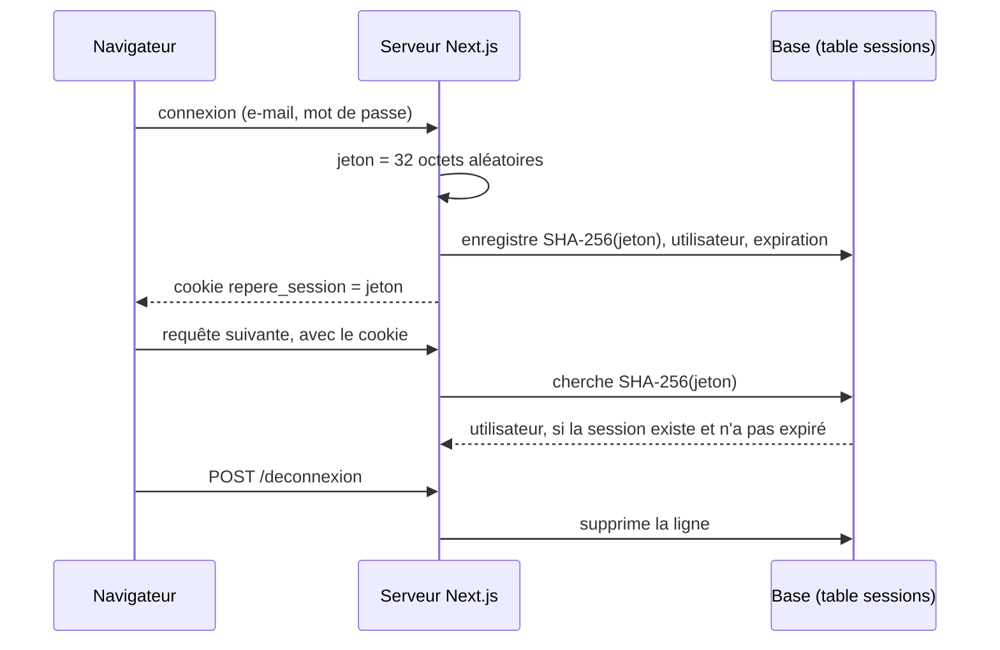

# Authentification, autorisation et sécurité

Ce document explique comment un utilisateur est identifié, comment chaque
accès est contrôlé sur le serveur, et quelles sont les limites connues. Il
correspond à la ligne « Authentification, autorisation & sécurité » du barème.

Documents liés : [rendu, données et mutations](choix-de-rendu.md) ·
[API mobile](api-mobile.md).

## Vue d'ensemble

| Client             | Identification                      | Code                      |
| ------------------ | ----------------------------------- | ------------------------- |
| Site (navigateur)  | Cookie de session `repere_session`  | `src/lib/auth/session.ts` |
| Application mobile | Jeton `Authorization: Bearer rpm_…` | `src/lib/mobile/auth.ts`  |

Les deux mécanismes sont indépendants : une route de l'API mobile n'accepte pas
le cookie, et une page du site n'accepte pas le jeton. Ils partagent la même
table `users` et la même vérification du mot de passe.

L'authentification est écrite dans le projet, sans fournisseur externe (ni
Auth.js, ni Supabase Auth). Le code reste court et je peux en expliquer chaque
ligne. Ce qu'il ne fait pas est listé dans les limites connues.

## Deux rôles

| Rôle     | Accès                                               |
| -------- | --------------------------------------------------- |
| `member` | Espace membre, ses propres réservations et arrivées |
| `admin`  | Tout l'espace membre, plus `/admin/*` et `/qrcode`  |

Le rôle est la colonne `users.role`. Un administrateur peut promouvoir ou
rétrograder un autre compte depuis `/admin/utilisateurs/[id]`.

## Les mots de passe

`src/lib/auth/password.ts`.

- Hachage avec **scrypt** (module `node:crypto`, aucune dépendance), sel
  aléatoire de 16 octets par mot de passe, clé de 64 octets. La base stocke
  `sel:hash`.
- Vérification avec `timingSafeEqual` : le temps de réponse ne révèle pas
  combien d'octets correspondaient.
- `passwordHash` ne sort jamais de `src/lib/data/users.ts` : le type `User`
  utilisé par le reste de l'application n'a pas ce champ.
- Règle de saisie : 8 caractères au minimum (`src/lib/validation/auth.ts`).

## Inscription, connexion, déconnexion

| Étape       | Ce qui se passe                                                                                                                                       | Code                             |
| ----------- | ----------------------------------------------------------------------------------------------------------------------------------------------------- | -------------------------------- |
| Inscription | Validation zod → e-mail déjà pris ? → création du compte (mot de passe haché, 20 crédits) → session → `/bienvenue`                                    | `(auth)/inscription/_actions.ts` |
| Connexion   | Validation zod → frein si trop d'échecs → vérification du mot de passe → session → `/tableau-de-bord`, ou `/bienvenue` si l'onboarding n'est pas fait | `(auth)/connexion/_actions.ts`   |
| Déconnexion | `POST /deconnexion` → suppression de la session en base, puis du cookie → retour à l'accueil                                                          | `(auth)/deconnexion/route.ts`    |

À la connexion, le message d'erreur est le même pour une adresse inconnue et
pour un mauvais mot de passe : il ne permet pas de savoir si une adresse a un
compte.

**Frein contre les essais répétés.** Après 10 mots de passe faux en 10 minutes
pour une même adresse, les tentatives suivantes sont refusées avant même que le
mot de passe soit vérifié (`src/lib/mobile/rate-limit.ts`). Le frein est le
même pour le site et pour l'application mobile, et une connexion réussie le
remet à zéro.

## La session du site

Le cookie `repere_session` contient un **jeton opaque** : 256 bits aléatoires,
sans aucune information dedans. Ce n'est ni l'identifiant de l'utilisateur, ni
une donnée signée : connaître quelqu'un ne donne aucun moyen de fabriquer son
cookie.

| Élément                    | Choix                                                 | Pourquoi                                                             |
| -------------------------- | ----------------------------------------------------- | -------------------------------------------------------------------- |
| Ce que contient le cookie  | Un jeton aléatoire                                    | Impossible à deviner ou à fabriquer                                  |
| Ce que contient la base    | L'empreinte SHA-256 du jeton (`sessions.tokenHash`)   | Une base volée ne permet pas de se connecter à la place de quelqu'un |
| Durée                      | 30 jours (`sessions.expiresAt` et `maxAge` du cookie) | Une session expirée est refusée même si le cookie existe encore      |
| Déconnexion                | La ligne est supprimée                                | Le jeton cesse de fonctionner même s'il a été copié ailleurs         |
| Changement de mot de passe | Les autres sessions du compte sont supprimées         | Un navigateur resté connecté ailleurs est déconnecté                 |

SHA-256 suffit pour le jeton (pas besoin de scrypt comme pour un mot de passe) :
256 bits aléatoires ne peuvent pas être retrouvés à partir de leur empreinte.

Attributs du cookie, posés par `createSession()` :

| Attribut   | Valeur            | Effet                                                                           |
| ---------- | ----------------- | ------------------------------------------------------------------------------- |
| `httpOnly` | oui               | Illisible par le JavaScript de la page                                          |
| `sameSite` | `lax`             | Non envoyé par une requête `POST` venant d'un autre site                        |
| `secure`   | oui en production | Envoyé seulement en HTTPS (les navigateurs l'acceptent en HTTP sur `localhost`) |
| `maxAge`   | 30 jours          |                                                                                 |

Code : `src/lib/auth/session.ts` (cookie, jeton, gardes) et
`src/lib/data/sessions.ts` (lecture et écriture de la table).

`getSession()` lit le cookie **sur le serveur**, cherche la session, charge
l'utilisateur et le renvoie, ou `null`. Elle est enveloppée dans `cache()` de
React : dans une même requête, le layout, la page et les composants serveur
partagent une seule lecture.

Comme l'utilisateur est relu à chaque requête, un changement de rôle ou la
suppression d'un compte prend effet immédiatement.

C'est le même principe que les sessions de l'application mobile
(`mobile_sessions`). Les deux tables restent séparées : un jeton mobile ne
peut pas servir de cookie, et inversement.

## Les gardes serveur

Trois fonctions, dans `src/lib/auth/session.ts` :

| Garde                | Condition                                   | Sinon                                                               |
| -------------------- | ------------------------------------------- | ------------------------------------------------------------------- |
| `requireUser()`      | Être connecté                               | Redirection vers `/connexion` avec le message « Connexion requise » |
| `requireOnboarded()` | Être connecté et avoir terminé l'onboarding | Redirection vers `/bienvenue`                                       |
| `requireAdmin()`     | Être connecté avec le rôle `admin`          | Redirection vers `/acces-refuse`                                    |

Elles redirigent **avant** toute lecture de donnée protégée. Ce n'est pas un
masquage d'interface : un visiteur non autorisé ne reçoit pas la page.

### Où elles sont appelées

Une garde dans un layout ne suffit pas, pour deux raisons : une page peut être
rendue sans que son layout soit ré-exécuté lors d'une navigation, et une Server
Action est un point d'entrée HTTP appelable directement. J'appelle donc la
garde à trois niveaux.

| Niveau        | Exemple                                                                                                                                                                                                                                      |
| ------------- | -------------------------------------------------------------------------------------------------------------------------------------------------------------------------------------------------------------------------------------------- |
| Layout        | `(app)/layout.tsx` → `requireOnboarded()` ; `(app)/admin/layout.tsx` → `requireAdmin()` ; `(onboarding)/layout.tsx` → `requireUser()`                                                                                                        |
| Page          | Chaque page sous `(app)` appelle `requireOnboarded()` ; chaque page sous `admin`, ainsi que `/qrcode`, appelle `requireAdmin()`. Seule exception : `parametres/page.tsx`, qui ne lit rien et ne fait que rediriger vers `/parametres/profil` |
| Server Action | Première ligne de chaque action : `requireOnboarded()` pour l'espace membre, `requireAdmin()` pour l'administration, `requireUser()` pour l'onboarding                                                                                       |

Les seules actions sans garde sont celles qui doivent être publiques :
`loginAction`, `registerAction` et `setLocaleAction` (choix de la langue).

## Autorisation par ressource

Être connecté ne donne pas accès aux données des autres. Chaque lecture ou
écriture d'une ressource personnelle vérifie le propriétaire.

| Ressource                       | Vérification                                                    | Réponse si ce n'est pas la sienne     |
| ------------------------------- | --------------------------------------------------------------- | ------------------------------------- |
| Détail d'une réservation        | `getReservation(userId, id)` compare `record.userId`            | Page « introuvable » (404)            |
| Annulation                      | `reservation.userId !== user.id` dans `cancelReservationAction` | « Cette réservation est introuvable » |
| Validation d'une arrivée        | `performCheckIn(userId, …)` compare `reservation.userId`        | « Réservation introuvable »           |
| Détail d'une arrivée            | `getCheckIn(userId, id)` compare `row.userId`                   | Page « introuvable » (404)            |
| Listes (réservations, arrivées) | Les requêtes filtrent par `userId`                              | —                                     |

Une ressource qui appartient à quelqu'un d'autre reçoit **la même réponse**
qu'une ressource qui n'existe pas : on ne peut pas deviner qu'un identifiant
est valide.

Garde-fous de l'administration :

- un administrateur ne peut pas changer son propre rôle (le champ est
  désactivé, et l'action impose `admin` pour son propre compte) ;
- il ne peut pas supprimer son propre compte.

## Validation des entrées

Toute donnée venant du navigateur est validée par un schéma zod avant d'être
utilisée (`src/lib/validation/`, et `src/lib/mobile/schemas.ts` pour l'API).

- Les valeurs de `searchParams` sont comparées à une liste connue ; une valeur
  inconnue est ignorée (`/lieux`, `/reserver`, `/reservations`).
- Un champ numérique vide est lu comme « pas un nombre » et refusé, au lieu de
  devenir 0 (`toNumber` dans `admin/lieux/[id]/_actions.ts`).
- Les identifiants passés à une action (`reservationId`, `spaceId`) ne sont
  jamais crus : l'action relit la ressource et vérifie les droits.

## Secrets et données envoyées au navigateur

- Une seule variable d'environnement : `DATABASE_URL`. Elle n'a pas de préfixe
  `NEXT_PUBLIC_` : elle n'est donc jamais incluse dans le code envoyé au
  navigateur. Le projet ne contient aucune variable `NEXT_PUBLIC_`.
- `.env` et tous les `.env.*` sont ignorés par Git (seul `.env.example` est
  suivi) et par `.dockerignore`. L'image Docker ne contient aucun secret : la
  variable est lue au démarrage du conteneur.
- Les modules d'accès aux données importent `server-only` : les importer dans
  un composant client fait échouer le build.
- Les composants client ne reçoivent que ce qu'ils affichent. Pour les
  disponibilités d'un espace, par exemple, seuls le début et la fin des
  créneaux pris sont transmis.
- Les identifiants de la base dans `docker-compose.yml` et `.env.example`
  (`repere` / `repere`) sont des valeurs de démonstration pour un PostgreSQL
  local. Une vraie base aurait un mot de passe injecté par l'hébergeur.

## Protections apportées par le cadre

- **Server Actions** : Next.js compare l'en-tête `Origin` à l'hôte de la
  requête et refuse l'action s'ils diffèrent. Avec le cookie `sameSite=lax`,
  un autre site ne peut pas déclencher une action au nom d'un membre connecté.
- **Déconnexion en `POST`** : un lien préchargé ou un robot ne peut pas
  déconnecter un utilisateur.
- **Erreurs** : en production Next.js ne transmet pas le message d'une erreur
  serveur au navigateur, seulement une référence (`digest`). Les messages que
  le membre lit sont ceux que mes actions renvoient volontairement.

## L'API mobile, en bref

Détail dans [api-mobile.md](api-mobile.md).

- Jeton opaque de 256 bits aléatoires, renvoyé une seule fois à la connexion.
  La base ne garde que son empreinte SHA-256 (`mobile_sessions.tokenHash`).
- Expiration à 14 jours, révocation réelle à la déconnexion.
- Changer son mot de passe, depuis le site ou depuis l'application, met fin aux
  autres sessions du compte, navigateurs et téléphones : un appareil qui ne
  connaît que l'ancien mot de passe cesse de fonctionner.
- Même frein de connexion que le site : 10 échecs en 10 minutes pour une
  adresse.
- Réservation, annulation et validation d'arrivée dans des transactions.

## Écritures sensibles

Réserver et annuler touchent deux choses à la fois : la réservation et le solde
de crédits. Ces opérations sont faites dans **une transaction**, pour le site
comme pour l'application mobile.

| Opération                | Fonction                                                       | Garantie                                                                                                                                                                                |
| ------------------------ | -------------------------------------------------------------- | --------------------------------------------------------------------------------------------------------------------------------------------------------------------------------------- |
| Réserver                 | `createReservation` (`src/lib/mobile/reservations.ts`)         | Isolation `SERIALIZABLE` : de deux demandes simultanées pour le même créneau, une seule passe. Le débit est un `UPDATE … WHERE credits >= coût` : le solde ne peut pas devenir négatif. |
| Annuler (membre)         | `cancelReservation` (même fichier)                             | Le statut ne change que s'il est encore « confirmée » : le remboursement n'est versé qu'une fois.                                                                                       |
| Annuler (administrateur) | `cancelReservationWithRefund` (`src/lib/data/reservations.ts`) | Même principe : statut et remboursement dans la même transaction.                                                                                                                       |

Je l'ai vérifié en envoyant quatre demandes de réservation identiques au même
instant : une seule a été acceptée (`201`), les trois autres refusées (`409`),
et le solde n'a été débité qu'une fois.

## Vérifier soi-même

| Test                                                                                                                         | Résultat attendu                                                   |
| ---------------------------------------------------------------------------------------------------------------------------- | ------------------------------------------------------------------ |
| Ouvrir `/tableau-de-bord` sans être connecté                                                                                 | Redirection vers `/connexion`, message « Connexion requise »       |
| Se connecter en membre, ouvrir `/admin`                                                                                      | Page « accès refusé »                                              |
| Se connecter en membre, ouvrir `/qrcode`                                                                                     | Page « accès refusé »                                              |
| Créer un compte, ouvrir `/tableau-de-bord` avant l'onboarding                                                                | Redirection vers `/bienvenue`                                      |
| Ouvrir `/reservations/<identifiant d'une réservation d'un autre compte>`                                                     | Page « introuvable »                                               |
| Se connecter avec un mauvais mot de passe                                                                                    | Même message que pour une adresse inconnue                         |
| Onze mauvais mots de passe de suite pour une adresse                                                                         | Le onzième essai répond « Trop de tentatives de connexion… »       |
| `curl -H "Cookie: repere_session=u-admin" -I http://localhost:3000/admin` (un identifiant d'utilisateur à la place du jeton) | Redirection vers `/connexion` : un identifiant ne vaut pas session |
| `curl http://localhost:3000/api/mobile/v1/me`                                                                                | `401` et `{"error":{"code":"UNAUTHENTICATED",…}}`                  |

## Limites connues

Je préfère les écrire que les laisser découvrir.

1. **Le frein de connexion vit en mémoire du processus.** Il est remis à zéro
   au redémarrage du serveur et ne serait pas partagé entre plusieurs
   instances. Pour un déploiement à plusieurs serveurs, il faudrait le stocker
   en base ou dans un cache partagé.
2. **Pas de réinitialisation de mot de passe ni de vérification de l'adresse
   e-mail** : l'application n'envoie aucun e-mail.
3. **La position envoyée pour valider une arrivée peut être falsifiée** (outils
   du navigateur, téléphone modifié). Le serveur décide, mais il ne peut
   vérifier la présence que dans la mesure où l'appareil dit vrai.
4. **Les sessions expirées ne sont nettoyées qu'à la connexion suivante** du
   même utilisateur. Elles sont refusées dès leur expiration, mais leurs lignes
   restent en base jusque-là.
5. **Les identifiants de la base de démonstration sont dans le dépôt**
   (`repere` / `repere`) : ils ne valent que pour le PostgreSQL local.
