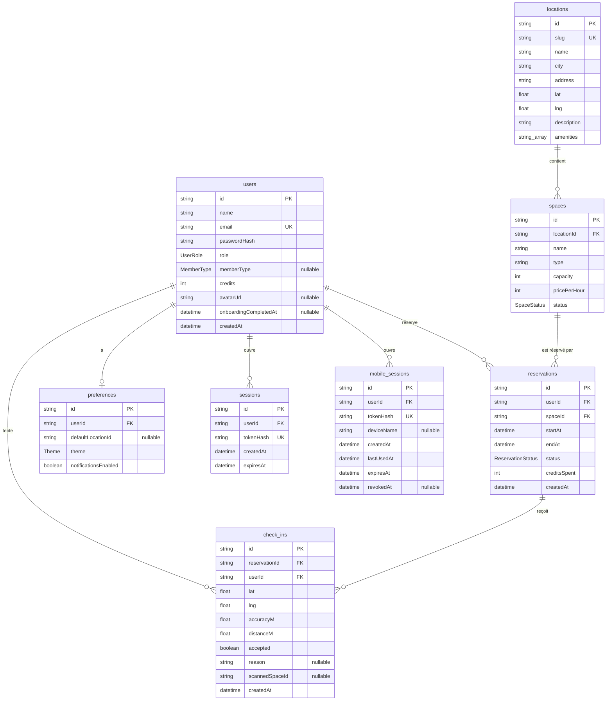

# Base de données

Ce document contient le schéma de données (livrable demandé par le sujet), les
choix techniques, et les commandes pour lancer et faire évoluer la base.

Documents liés : [architecture](architecture.md) ·
[rendu, données et mutations](choix-de-rendu.md).

## Choix

| Élément           | Choix                                   | Pourquoi                                                                                     |
| ----------------- | --------------------------------------- | -------------------------------------------------------------------------------------------- |
| Base              | PostgreSQL 16                           | Relations, contraintes d'unicité, transactions : ce dont une réservation a besoin            |
| Hébergement local | Docker (`docker-compose.yml`)           | Aucune installation sur le poste ; port hôte `5433` pour ne pas gêner un PostgreSQL existant |
| Accès             | Prisma 7 avec l'adaptateur `pg`         | Schéma lisible, migrations versionnées, client typé                                          |
| Client généré     | `src/generated/prisma` (ignoré par Git) | Généré par `prisma generate` à chaque `npm install` (`postinstall`)                          |

Le sujet recommande Supabase sans l'imposer et autorise « Prisma +
PostgreSQL ». J'ai choisi cette seconde option : la base est la mienne, lancée
en une commande, et tout l'accès aux données reste dans le code du projet.

Au début du projet les données étaient dans des fichiers JSON derrière les
mêmes fonctions (`listX`, `getXById`, `createX`, `updateX`). Je les ai
remplacés par PostgreSQL (commit `0bfe0bc`) en gardant ces fonctions : les
pages et les actions n'ont presque pas changé.

## Schéma de données

Source : `prisma/schema.prisma`.



Les identifiants sont des chaînes : un UUID généré par défaut
(`@default(uuid())`). Les lignes du seed ont des identifiants lisibles
(`le-chantier-lyon`, `chantier-flex`, `u-camille`) pour être faciles à
reconnaître en démonstration.

## Les tables

| Table             | Rôle                                                                          | Écrite par                                    |
| ----------------- | ----------------------------------------------------------------------------- | --------------------------------------------- |
| `users`           | Comptes : identité, mot de passe haché, rôle, solde de crédits                | Inscription, profil, sécurité, administration |
| `locations`       | Lieux de coworking, avec coordonnées GPS et adresse web (`slug`)              | Administration                                |
| `spaces`          | Espaces réservables d'un lieu : type, capacité, prix par heure, statut        | Administration                                |
| `reservations`    | Une réservation d'un espace par un membre sur un créneau                      | Réservation, annulation                       |
| `preferences`     | Préférences d'un membre (une ligne par utilisateur)                           | Onboarding, paramètres                        |
| `sessions`        | Sessions du site : empreinte du jeton du cookie, expiration                   | Connexion, déconnexion                        |
| `mobile_sessions` | Sessions de l'application mobile (empreinte du jeton, expiration, révocation) | API mobile                                    |
| `check_ins`       | Chaque tentative de validation d'arrivée, acceptée ou refusée                 | Site et API mobile                            |

## Les énumérations

| Enum                | Valeurs                               | Remarque                                      |
| ------------------- | ------------------------------------- | --------------------------------------------- |
| `UserRole`          | `member`, `admin`                     | `member` par défaut                           |
| `MemberType`        | `freelance`, `entreprise`, `etudiant` | Vide tant que l'onboarding n'est pas fait     |
| `SpaceStatus`       | `active`, `maintenance`               | Un espace en maintenance n'est pas réservable |
| `ReservationStatus` | `confirmed`, `cancelled`, `completed` | Voir la note ci-dessous                       |
| `Theme`             | `light`, `dark`, `system`             |                                               |

Deux colonnes sont des chaînes et non des enums, volontairement :

- `spaces.type` (`poste-flex`, `bureau-prive`, `salle-reunion`, `phone-booth`) :
  ces valeurs contiennent un tiret, ce qu'un identifiant d'enum Prisma
  n'accepte pas. L'ensemble des valeurs est contrôlé par zod
  (`src/lib/validation/space.ts`).
- `check_ins.reason` (`TOO_FAR`, `TOO_EARLY`…) : l'ensemble est contrôlé dans
  `src/lib/mobile/checkin.ts`.

**Note sur `completed`.** La valeur existe dans l'enum mais n'est jamais
écrite. Une réservation « terminée » est une réservation `confirmed` dont
l'heure de fin est passée : c'est calculé à la lecture (`reservationPhase` dans
`src/lib/member/reservations.ts`, et `displayStatus` dans
`admin/reservations/page.tsx`). Aucune tâche planifiée n'est donc nécessaire.

## Relations et contraintes

| Relation                                   | Suppression                                                                               |
| ------------------------------------------ | ----------------------------------------------------------------------------------------- |
| `spaces.locationId` → `locations`          | `ON DELETE CASCADE`                                                                       |
| `reservations.userId` → `users`            | `ON DELETE CASCADE` : supprimer un compte supprime ses réservations                       |
| `reservations.spaceId` → `spaces`          | `ON DELETE CASCADE` : d'où le refus de supprimer un espace qui a des réservations à venir |
| `preferences.userId` → `users`             | `ON DELETE CASCADE`, unique (une ligne par utilisateur)                                   |
| `sessions.userId` → `users`                | `ON DELETE CASCADE` : supprimer un compte ferme ses sessions                              |
| `mobile_sessions.userId` → `users`         | `ON DELETE CASCADE`                                                                       |
| `check_ins.reservationId` → `reservations` | `ON DELETE CASCADE`                                                                       |
| `check_ins.userId` → `users`               | `ON DELETE CASCADE`                                                                       |

Contraintes d'unicité : `users.email`, `locations.slug`,
`preferences.userId`, `sessions.tokenHash`, `mobile_sessions.tokenHash`.

Index : `spaces(locationId)`, `reservations(userId)`, `reservations(spaceId)`,
`sessions(userId)`, `mobile_sessions(userId)`, `check_ins(reservationId)`,
`check_ins(userId, createdAt)`.

## Migrations

Les migrations sont versionnées dans `prisma/migrations/`.

| Migration                                  | Contenu                                                              |
| ------------------------------------------ | -------------------------------------------------------------------- |
| `20260916131237_init`                      | `users`, `locations`, `spaces`, `reservations`, `preferences`, enums |
| `20260921095849_add_mobile_api_tables`     | `mobile_sessions`, `check_ins`                                       |
| `20261002092854_add_checkin_scanned_space` | Colonne `check_ins.scannedSpaceId` (nullable)                        |
| `20261007140820_add_web_sessions`          | `sessions` : les sessions du site                                    |

Les trois dernières n'ajoutent que des tables ou une colonne facultative :
aucune ne modifie une table existante.

## Données de démonstration

`prisma/seed.ts` crée :

- 4 lieux : Le Chantier (Lyon), Station 9 (Nantes), La Verrière (Bordeaux), Le
  Comptoir (Lille) ;
- 12 espaces, 3 par lieu ;
- 2 comptes, mot de passe `demo1234` : `camille@example.com` (membre, 250
  crédits) et `admin@example.com` (administratrice, 500 crédits).

Les lieux sont fictifs. Le script utilise des `upsert` : le relancer remet les
données de démonstration à leur état initial sans créer de doublons. Avec la
variable `SEED_ONLY_IF_EMPTY=1` (posée par Docker Compose) il ne fait rien si
un utilisateur existe déjà.

## Accès aux données dans le code

| Fichier                        | Contenu                                                                  |
| ------------------------------ | ------------------------------------------------------------------------ |
| `src/lib/db/prisma.ts`         | Le client Prisma unique, relié à PostgreSQL par l'adaptateur `pg`        |
| `src/lib/data/users.ts`        | Comptes, vérification du mot de passe                                    |
| `src/lib/data/locations.ts`    | Lieux, dont `getCachedLocations` (lecture mise en cache)                 |
| `src/lib/data/spaces.ts`       | Espaces, dont `getCachedSpaces`                                          |
| `src/lib/data/reservations.ts` | Réservations                                                             |
| `src/lib/data/preferences.ts`  | Préférences                                                              |
| `src/lib/data/sessions.ts`     | Sessions du site (création, recherche, suppression)                      |
| `src/lib/mobile/*.ts`          | Requêtes de l'API mobile et de l'espace membre (transactions, jointures) |
| `src/types/domain.ts`          | Les types métier renvoyés au reste de l'application                      |

Règles que suivent ces fichiers :

- ils commencent par `import "server-only"` ;
- chaque fonction convertit la ligne Prisma en type métier (`toUser`,
  `toLocation`…) : dates en chaînes ISO, et **jamais** `passwordHash` ;
- `updateX` renvoie `null` et `deleteX` renvoie `false` en cas d'échec, au lieu
  de lever une exception : l'appelant vérifie le retour et répond par un
  message ;
- le client Prisma est gardé sur `globalThis` en développement, pour ne pas
  ouvrir un nouveau pool de connexions à chaque rechargement de module.

## Commandes

```bash
npm run db:up        # démarre PostgreSQL dans Docker (port hôte 5433)
npm run db:migrate   # applique les migrations (prisma migrate dev)
npm run db:seed      # charge les données de démonstration
npm run db:studio    # interface Prisma Studio pour consulter la base
npm run db:down      # arrête le conteneur ; les données restent dans le volume
```

Après une modification de `prisma/schema.prisma` :

```bash
npx prisma migrate dev --name nom_de_la_migration
```

Cette commande crée la migration SQL, l'applique et régénère le client. Il faut
ensuite redémarrer `npm run dev` : le client déjà chargé ne connaît pas le
nouveau schéma.

La connexion est définie par la variable `DATABASE_URL` (voir `.env.example`).
`prisma.config.ts` charge `.env` pour la CLI Prisma ; à l'exécution,
l'application lit `process.env.DATABASE_URL` dans `src/lib/db/prisma.ts`.

`docker compose down -v` supprime le volume, donc **toutes les données** : à ne
lancer que pour repartir de zéro.

## Transactions

Une réservation et une annulation modifient deux tables à la fois
(`reservations` et `users.credits`). Elles sont faites dans une transaction :
les deux écritures réussissent ensemble, ou aucune.

| Opération                | Fonction                                                       | Mécanisme                                                                                                                        |
| ------------------------ | -------------------------------------------------------------- | -------------------------------------------------------------------------------------------------------------------------------- |
| Réserver                 | `createReservation` (`src/lib/mobile/reservations.ts`)         | Transaction `SERIALIZABLE`, rejouée jusqu'à 3 fois si PostgreSQL signale un conflit ; débit par `UPDATE … WHERE credits >= coût` |
| Annuler (membre)         | `cancelReservation` (même fichier)                             | `UPDATE … WHERE status = 'confirmed'`, puis remboursement                                                                        |
| Annuler (administrateur) | `cancelReservationWithRefund` (`src/lib/data/reservations.ts`) | Même principe                                                                                                                    |
| Valider une arrivée      | `performCheckIn` (`src/lib/mobile/checkin.ts`)                 | Transaction `SERIALIZABLE` : une seule arrivée validée par réservation                                                           |

Le site et l'application mobile appellent les mêmes fonctions.

## Limites connues

- `preferences.defaultLocationId` n'est pas une clé étrangère. Les actions
  vérifient que le lieu existe au moment de l'enregistrement.
- Trois colonnes sont enregistrées mais pas encore exploitées :
  `users.avatarUrl` (l'avatar affiché est l'initiale du nom),
  `preferences.theme` (le thème est mémorisé dans le navigateur) et
  `preferences.notificationsEnabled` (le choix est enregistré, aucune
  notification n'est envoyée). Le lieu par défaut est enregistré et modifiable
  dans les préférences, mais ne pré-filtre pas encore la recherche.
- Les sessions expirées ne sont supprimées qu'à la connexion suivante du même
  utilisateur.
