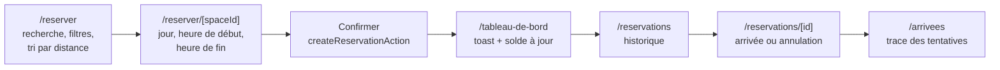

# Fonctionnalités et parcours métier

Ce document liste ce que l'application fait réellement, expérience par
expérience, puis décrit le parcours principal de bout en bout et les règles
métier. Il correspond à la ligne « Fonctionnalités & parcours métier » du
barème.

Tout ce qui est décrit ici est persisté dans PostgreSQL : rien n'est simulé
dans le navigateur. Seules les données de départ (4 lieux, 12 espaces, 2
comptes) viennent d'un script de seed.

## Le produit en une minute

Repère est une plateforme de réservation d'espaces de coworking.

- Un **visiteur** découvre les lieux et les tarifs sans compte.
- Un **membre** réserve un poste, un bureau, une cabine ou une salle à
  l'heure, paie en **crédits**, valide son arrivée sur place et retrouve son
  historique.
- Un **administrateur** gère les lieux, les espaces, les utilisateurs et les
  réservations.
- L'**application mobile** (dépôt séparé) utilise le même compte et les mêmes
  données, par l'API `/api/mobile/v1`.

## Les sept expériences demandées

### 1. Marketing (public)

| Fonctionnalité                                                                           | Où                                                         |
| ---------------------------------------------------------------------------------------- | ---------------------------------------------------------- |
| Page d'accueil avec proposition de valeur et recherche                                   | `/`                                                        |
| Recherche par ville et type d'espace (formulaire sans JavaScript)                        | `/` → `/lieux?ville=&type=`                                |
| Liste des lieux avec filtres dans l'URL                                                  | `/lieux`                                                   |
| Page publique dynamique d'un lieu                                                        | `/lieux/[slug]`                                            |
| Tarifs : prix par type d'espace **lus en base**                                          | `/tarifs`                                                  |
| Fonctionnalités, FAQ, présentation de l'application mobile                               | `/fonctionnalites`, `/faq`, `/vision-mobile`               |
| Appel à l'action adapté au visiteur (créer un compte) ou au membre connecté (mon espace) | en-tête et bandeau de fin de page                          |
| Français / anglais, thème clair / sombre                                                 | en-tête                                                    |
| Métadonnées, `sitemap.xml`, `robots.txt`                                                 | voir [performance, cache et SEO](performance-cache-seo.md) |

### 2. Authentification

| Fonctionnalité                                                   | Où                                                                   |
| ---------------------------------------------------------------- | -------------------------------------------------------------------- |
| Inscription (20 crédits offerts)                                 | `/inscription`                                                       |
| Connexion (mot de passe vérifié, haché en base)                  | `/connexion`                                                         |
| Frein après 10 mots de passe faux en 10 minutes pour une adresse | `/connexion`                                                         |
| Remplissage rapide des comptes de démonstration                  | `/connexion`                                                         |
| Déconnexion (avec confirmation dans l'espace membre)             | `POST /deconnexion`                                                  |
| Session lue sur le serveur à chaque requête                      | `src/lib/auth/session.ts`                                            |
| Routes protégées par des gardes serveur                          | voir [authentification et sécurité](authentification-et-securite.md) |

### 3. Onboarding

Après l'inscription, le compte n'a pas encore accès à l'espace membre. Le
membre passe par `/bienvenue` puis `/profil`, où il indique :

- sa situation : freelance, entreprise ou étudiant ;
- le lieu qu'il utilisera le plus souvent.

La validation enregistre ces deux informations et la date de fin d'onboarding
(`onboardingCompletedAt`). Tant que cette date est vide, toute page de l'espace
membre renvoie vers `/bienvenue` ; une fois remplie, `/bienvenue` et `/profil`
renvoient vers l'espace membre.

### 4. Espace membre

| Fonctionnalité                                                                                                 | Où                   |
| -------------------------------------------------------------------------------------------------------------- | -------------------- |
| Accueil : prochaine réservation, délai (« Dans 2 h »), raccourcis                                              | `/tableau-de-bord`   |
| Activité : solde, réservations à venir, heures et crédits des 30 derniers jours, taux de présence, lieu favori | `/tableau-de-bord`   |
| Liste des réservations par jour, trois vues (à venir, passées, toutes)                                         | `/reservations`      |
| Détail d'une réservation                                                                                       | `/reservations/[id]` |
| Historique des arrivées, filtre par jour                                                                       | `/arrivees`          |
| Détail d'une tentative d'arrivée (distance, précision, motif)                                                  | `/arrivees/[id]`     |
| Navigation persistante : barre latérale sur ordinateur, barre d'onglets sur téléphone                          | layout `(app)`       |
| Bandeau « hors ligne » quand la connexion est perdue                                                           | layout `(app)`       |

### 5. Module métier : la réservation

| Fonctionnalité                                                 | Où                                 |
| -------------------------------------------------------------- | ---------------------------------- |
| Recherche par nom, filtres par lieu et type                    | `/reserver`                        |
| Tri par distance avec la position réelle du navigateur         | `/reserver`                        |
| Pastille « Libre » ou « Occupé maintenant » par espace         | `/reserver`                        |
| « Réserver près de moi » : l'espace libre le plus proche       | `/reserver`                        |
| Carte des lieux (Leaflet, fonds OpenStreetMap)                 | `/reserver`, `/reserver/[spaceId]` |
| Calendrier mensuel, heure de début, heure de fin, coût affiché | `/reserver/[spaceId]`              |
| Confirmation avec débit des crédits                            | `/reserver/[spaceId]`              |
| Annulation avec remboursement                                  | `/reservations/[id]`               |
| Validation de l'arrivée par géolocalisation                    | `/reservations/[id]`               |

### 6. Paramètres

| Onglet      | Ce qui est modifiable et persisté                                                             |
| ----------- | --------------------------------------------------------------------------------------------- |
| Profil      | Prénom, nom, situation (table `users`)                                                        |
| Sécurité    | Adresse e-mail et mot de passe, avec le mot de passe actuel (table `users`)                   |
| Préférences | Lieu par défaut et notifications (table `preferences`) ; langue (cookie) ; thème (navigateur) |

Chaque formulaire répond par un toast de succès ou d'erreur, et affiche
l'erreur sous le champ concerné.

### 7. Back-office

| Fonctionnalité                                                                                                                                | Où                                                          |
| --------------------------------------------------------------------------------------------------------------------------------------------- | ----------------------------------------------------------- |
| Statistiques : lieux, espaces actifs, membres, réservations confirmées, réservations du jour, nouveaux membres sur 30 jours, crédits dépensés | `/admin`                                                    |
| Cinq dernières réservations                                                                                                                   | `/admin`                                                    |
| Lieux : liste, création, modification                                                                                                         | `/admin/lieux`, `/admin/lieux/nouveau`, `/admin/lieux/[id]` |
| Espaces d'un lieu : création, passage en maintenance, suppression                                                                             | `/admin/lieux/[id]`                                         |
| Utilisateurs : liste, détail avec ses réservations                                                                                            | `/admin/utilisateurs`, `/admin/utilisateurs/[id]`           |
| Utilisateur : changer le rôle, ajuster les crédits, supprimer le compte                                                                       | `/admin/utilisateurs/[id]`                                  |
| Réservations : liste filtrée par statut (`?status=`), détail, annulation avec remboursement                                                   | `/admin/reservations`, `/admin/reservations/[id]`           |
| QR codes de test, un par espace, pour l'application mobile                                                                                    | `/qrcode`                                                   |

Ce que le back-office ne fait pas : supprimer un lieu, et modifier le nom, le
type, la capacité ou le prix d'un espace existant (un espace se crée, se met en
maintenance ou se supprime).

### En plus : l'API de l'application mobile

17 points d'entrée JSON sous `/api/mobile/v1` : connexion par jeton, profil,
espaces à proximité, disponibilités, réservations, annulation, validation de
l'arrivée (position + QR code facultatif), historique. Le contrat complet est
dans [api-mobile.md](api-mobile.md).

## Le parcours principal, de bout en bout

Recherche → détail → créneau → confirmation → historique, comme demandé par le
sujet pour le thème « réservation ».

| Étape | Ce que fait le membre                                 | Ce qui se passe sur le serveur                                                    | Ce qui est écrit en base                          |
| ----- | ----------------------------------------------------- | --------------------------------------------------------------------------------- | ------------------------------------------------- |
| 1     | Cherche un espace, filtre, trie par distance          | La page lit les espaces actifs et lesquels sont occupés pour l'heure qui vient    | rien                                              |
| 2     | Ouvre un espace                                       | La page lit l'espace, son lieu et ses créneaux déjà pris (seulement début et fin) | rien                                              |
| 3     | Choisit un jour, une heure de début, une heure de fin | Le calendrier grise les heures passées ou prises ; le coût s'affiche              | rien                                              |
| 4     | Confirme                                              | `createReservationAction` revérifie tout (voir règles ci-dessous)                 | une ligne `reservations`, `users.credits` diminué |
| 5     | Arrive sur l'accueil                                  | Redirection avec message de confirmation ; le solde du menu est à jour            | rien                                              |
| 6     | Consulte ses réservations                             | `/reservations` lit les réservations du membre                                    | rien                                              |
| 7a    | Valide son arrivée sur place                          | `checkInAction` : le serveur décide à partir de la position envoyée               | une ligne `check_ins` (acceptée ou refusée)       |
| 7b    | Ou annule avant le début                              | `cancelReservationAction` : statut « annulée » et remboursement                   | `reservations.status`, `users.credits` augmenté   |

## Règles métier

Les règles sont appliquées **sur le serveur**. L'interface les reprend pour
guider le membre (heures grisées, bouton absent), mais ce n'est jamais elle qui
décide.

### Crédits

| Règle                                                         | Où dans le code                                                     |
| ------------------------------------------------------------- | ------------------------------------------------------------------- |
| 20 crédits offerts à l'inscription                            | `SIGNUP_BONUS_CREDITS`, `(auth)/inscription/_actions.ts`            |
| Coût = prix par heure × nombre d'heures, arrondi              | `createReservationAction`, `rangeCost` (`src/lib/booking/slots.ts`) |
| Débit à la réservation, remboursement intégral à l'annulation | `createReservationAction`, `cancelReservationAction`                |
| Un administrateur peut ajuster le solde (0 à 100 000)         | `adminUserSchema`, `updateUserAdminAction`                          |

Un compte reçoit des crédits à l'inscription, par le seed, ou par un
administrateur.

### Réservation

Le sélecteur (`BookingPicker`) ne propose que des heures pleines entre 9 h et
18 h, d'aujourd'hui jusqu'à la même date le mois suivant
(`src/lib/booking/slots.ts`).

`createReservationAction` (`(app)/reserver/[spaceId]/_actions.ts`) ne fait pas
confiance au sélecteur. Elle refuse la réservation si :

1. l'espace n'existe plus ;
2. l'espace est en maintenance ;
3. le créneau a déjà commencé ;
4. le créneau n'est pas en heures pleines, ou sort des heures d'ouverture
   (9 h – 18 h, heure de Paris — `src/lib/booking/opening-hours.ts`) ;
5. le créneau est à plus d'un mois (avec un jour de marge pour les fuseaux
   horaires) ;
6. le solde est insuffisant (le message indique combien il manque) ;
7. le créneau chevauche une réservation confirmée du même espace.

L'écriture elle-même est **une transaction** : le créneau est revérifié et les
crédits sont débités ensemble. Si deux membres confirment le même créneau au
même instant, un seul l'obtient ; l'autre reçoit un message et garde ses
crédits.

### Annulation

| Qui            | Conditions                                                                  | Où                             |
| -------------- | --------------------------------------------------------------------------- | ------------------------------ |
| Membre         | Sa propre réservation, confirmée, pas encore commencée, arrivée non validée | `cancelReservationAction`      |
| Administrateur | Toute réservation confirmée, sans condition de date                         | `adminCancelReservationAction` |

Dans les deux cas les crédits dépensés sont rendus au membre.

### Arrivée (check-in)

La décision est prise par `performCheckIn` (`src/lib/mobile/checkin.ts`), la
même fonction pour le site et pour l'application mobile. La première règle qui
échoue donne le motif :

| Motif            | Règle                                                                                 |
| ---------------- | ------------------------------------------------------------------------------------- |
| `NOT_CONFIRMED`  | La réservation doit être confirmée                                                    |
| `WRONG_SPACE`    | Si un QR code est scanné (application mobile), il doit être celui de l'espace réservé |
| `TOO_EARLY`      | La validation ouvre 15 minutes avant le début                                         |
| `TOO_LATE`       | Elle ferme à la fin du créneau                                                        |
| `LOW_ACCURACY`   | La position doit être précise à 100 m ou mieux                                        |
| `STALE_POSITION` | La position doit dater de moins d'une minute                                          |
| `TOO_FAR`        | Le membre doit être à 150 m ou moins du lieu                                          |

Chaque tentative, acceptée ou refusée, est enregistrée : c'est ce que montre la
page « Arrivées ». Une arrivée déjà validée ne peut pas l'être une seconde fois.
Les seuils sont regroupés dans `src/lib/mobile/config.ts`.

Sur le site, l'arrivée se valide avec la géolocalisation du navigateur. Le scan
du QR code de l'espace n'existe que dans l'application mobile (il demande la
caméra).

### Administration

| Règle                                                                                                                  | Où                        |
| ---------------------------------------------------------------------------------------------------------------------- | ------------------------- |
| Un administrateur ne peut pas modifier son propre rôle                                                                 | `updateUserAdminAction`   |
| Un administrateur ne peut pas supprimer son propre compte                                                              | `deleteUserAdminAction`   |
| Supprimer un utilisateur supprime ses réservations (cascade en base)                                                   | `prisma/schema.prisma`    |
| Un espace qui a encore des réservations à venir ne peut pas être supprimé                                              | `deleteSpaceAction`       |
| Un espace en maintenance n'est plus proposé à la réservation                                                           | `toggleSpaceStatusAction` |
| Deux lieux ne peuvent pas avoir la même adresse web : le slug de `/lieux/<slug>` est dérivé du nom et doit être unique | `createLocationAction`    |

## Scénario de démonstration

Avec les comptes du seed (mot de passe `demo1234`).

**Visiteur**

1. `/` : choisir une ville dans la recherche → `/lieux?ville=Lyon`.
2. Ouvrir « Le Chantier » → `/lieux/le-chantier-lyon`.
3. Ouvrir `/lieux/nimporte-quoi` : page « introuvable » du site.
4. Ouvrir `/tableau-de-bord` sans être connecté : redirection vers `/connexion`
   avec le message « Connexion requise ».

**Membre** — `camille@example.com`

1. Se connecter → accueil de l'espace membre.
2. « Réserver un espace » → choisir un espace → un jour → une heure de début →
   une heure de fin → confirmer. Le solde baisse dans le menu.
3. « Mes réservations » → ouvrir la réservation → « Annuler la réservation ».
   Le solde remonte.
4. « Mon compte » → Profil : changer le prénom, enregistrer (toast de succès).
   Vider le champ et enregistrer : l'erreur s'affiche sous le champ.
5. Ouvrir `/admin` : page « accès refusé ».

**Administrateur** — `admin@example.com`

1. `/admin` : statistiques.
2. Lieux → ouvrir un lieu → ajouter un espace, puis le passer en maintenance :
   il disparaît de `/reserver`.
3. Utilisateurs → ouvrir Camille → modifier ses crédits.
4. Réservations → filtrer « Confirmées » → ouvrir une réservation → l'annuler.
5. `/qrcode` : les QR codes de test des espaces, pour l'application mobile.

**Nouveau compte**

1. `/inscription` → `/bienvenue` → `/profil` → espace membre, avec 20 crédits.
