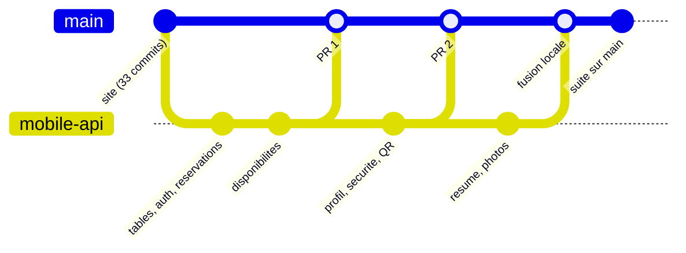

# Git et GitHub : comment j'ai organisé le travail

Ce document décrit ma façon de travailler avec Git sur ce projet : les
branches, la forme des commits, les vérifications avant chaque commit, et ce
qui n'entre jamais dans le dépôt. Il correspond à la ligne « Qualité du code,
tests, README & déploiement » du barème, et au point « repo Git propre » de la
soutenance.

Dépôt : <https://github.com/Benbecker69/next_js_m_deux> (public, branche
principale `main`).

## Mes règles

1. **Un commit = une fonctionnalité.** Je ne mélange pas deux sujets dans un
   commit. Chaque commit laisse le projet dans un état qui se lance.
2. **Un commit = un push.** Je pousse dès que le commit est fait : le dépôt
   distant reflète toujours l'état réel du travail.
3. **Je vérifie avant de committer** (voir plus bas). Si une vérification
   échoue, je corrige d'abord.
4. **Messages en anglais, à l'impératif**, avec une étiquette entre crochets.
5. **Aucun secret dans le dépôt** : `.env` n'est jamais suivi.

## Forme d'un message de commit

```
[étiquette] description courte à l'impératif
```

Exemples tirés de l'historique :

```
[feat] add reservation flow
[feat] add cache strategy on public listings
[fix] merge the admin section into the persistent member navigation
[perf] accessibility, responsive and edge-case polish pass
[docs] document the mobile account and QR check-in endpoints
[chore] merge mobile-api into main
```

| Étiquette    | Usage                                                 |
| ------------ | ----------------------------------------------------- |
| `[feat]`     | Nouvelle fonctionnalité                               |
| `[fix]`      | Correction d'un bug                                   |
| `[refactor]` | Réécriture sans changement de comportement            |
| `[style]`    | Mise en forme, CSS, animations                        |
| `[perf]`     | Performance, accessibilité                            |
| `[docs]`     | Documentation                                         |
| `[test]`     | Tests                                                 |
| `[build]`    | Outils de build, dépendances                          |
| `[ci]`       | Intégration continue                                  |
| `[chore]`    | Tâche d'entretien (premier commit, fusion de branche) |

La description dit **ce que le commit apporte**, pas la liste des fichiers
touchés : `git show` donne déjà cette liste.

## Vérifications avant chaque commit

```bash
npm run lint           # ESLint : règles Next.js, TypeScript, accessibilité
npm run typecheck      # tsc --noEmit, en mode strict
npm run format:check   # Prettier
npm run test           # tests unitaires (Vitest)
npm run build          # build de production
```

| Commande       | Ce qu'elle attrape                                                                                                         |
| -------------- | -------------------------------------------------------------------------------------------------------------------------- |
| `lint`         | Erreurs de hooks React, liens et images mal utilisés, attributs ARIA invalides                                             |
| `typecheck`    | Erreurs de type, variable inutilisée, clé de traduction oubliée en anglais                                                 |
| `format:check` | Fichier non formaté                                                                                                        |
| `test`         | Une règle métier cassée : créneau, heures d'ouverture, règle d'arrivée, validation                                         |
| `build`        | Ce que le mode développement tolère : import d'un module serveur dans un composant client, page rendue statique par erreur |

Le build est la vérification la plus importante : certains problèmes
n'apparaissent qu'en production. Pour un changement qui touche l'image Docker
ou l'authentification, je reconstruis aussi l'image et je rejoue le parcours
principal dans le conteneur, sur une base vierge.

Ces vérifications sont lancées à la main. Le dépôt n'a pas d'intégration
continue (voir les limites).

## Branches

| Branche      | Rôle                                                                         |
| ------------ | ---------------------------------------------------------------------------- |
| `main`       | Le site. Toujours dans un état qui se lance.                                 |
| `mobile-api` | L'API de l'application mobile, développée à part puis fusionnée dans `main`. |

J'ai développé l'API mobile sur une branche séparée pour une raison précise :
le site fonctionnait déjà, et je ne voulais pas risquer de le casser en
ajoutant des tables et des routes. Sur cette branche je me suis imposé de
**n'ajouter** que du code : nouvelles routes sous `src/app/api/`, nouveaux
fichiers dans `src/lib/mobile/`, migrations qui n'ajoutent que des tables ou
des colonnes facultatives. Les Server Actions et la session du site n'ont pas
été modifiées.



### Fusions

| Fusion                                  | Date              | Contenu                                                                                                 |
| --------------------------------------- | ----------------- | ------------------------------------------------------------------------------------------------------- |
| Pull request #1 (`mobile-api` → `main`) | 29 septembre 2026 | Tables mobiles, authentification par jeton, réservations, espaces à proximité, check-in, disponibilités |
| Pull request #2 (`mobile-api` → `main`) | 6 octobre 2026    | Profil, mot de passe et e-mail, QR code dans le check-in, page `/qrcode`, documentation de l'API        |
| Fusion locale (`58bd418`)               | 6 octobre 2026    | Résumé d'activité, photos des espaces, lien de retour vers le site                                      |

Depuis cette dernière fusion, tout le travail se fait sur `main` :
`mobile-api` n'a plus de commit qui lui soit propre.

## Déroulé du projet dans l'historique

L'historique se lit comme le plan de construction du produit.

| Période           | Ce qui a été construit                                                                                                                                                      |
| ----------------- | --------------------------------------------------------------------------------------------------------------------------------------------------------------------------- |
| 15 septembre      | Base du projet, composants d'interface, site public, authentification et gardes serveur, onboarding, espace membre, réservation, historique, paramètres, back-office, cache |
| 15 – 16 septembre | Accessibilité, responsive, retours utilisateur, français / anglais, comptes de démonstration                                                                                |
| 16 septembre      | Remplacement du stockage JSON de départ par PostgreSQL et Prisma                                                                                                            |
| 17 septembre      | Indicateurs des tableaux de bord, navigation unifiée membre / admin, toasts, navigation mobile                                                                              |
| 22 – 29 septembre | API mobile sur la branche `mobile-api` (pull request #1)                                                                                                                    |
| 6 octobre         | Suite de l'API mobile (pull request #2), messages d'erreur et squelettes de chargement, refonte du site public et du calendrier de réservation                              |
| 7 octobre         | Espace membre aligné sur l'application mobile, carte et réservation « près de moi », image Docker de production                                                             |

Pour le relire :

```bash
git log --oneline --graph      # l'historique, avec les fusions
git log --oneline -- src/lib/mobile   # l'histoire d'un dossier
git show 0bfe0bc --stat        # ce qu'un commit a touché
```

## Ce qui n'entre pas dans le dépôt

Défini dans `.gitignore`.

| Ignoré                           | Pourquoi                                                        |
| -------------------------------- | --------------------------------------------------------------- |
| `.env`, `.env.*`                 | Configuration locale et secrets. Seul `.env.example` est suivi. |
| `node_modules/`                  | Réinstallé par `npm install`                                    |
| `.next/`, `out/`, `build/`       | Produits par le build                                           |
| `src/generated/prisma`           | Client Prisma, régénéré par `npm install` (`postinstall`)       |
| `*.tsbuildinfo`, `next-env.d.ts` | Fichiers générés par TypeScript et Next.js                      |

`package-lock.json` est suivi : il garantit que `npm ci` installe exactement
les mêmes versions, y compris dans l'image Docker.

## Reprendre le projet

```bash
git clone https://github.com/Benbecker69/next_js_m_deux.git
cd next_js_m_deux
cp .env.example .env
npm install
npm run db:up && npm run db:migrate && npm run db:seed
npm run dev
```

Pour proposer une modification :

```bash
git switch -c feat/ma-fonctionnalite
# … modifier …
npm run lint && npm run typecheck && npm run format:check && npm run test && npm run build
git add -A
git commit -m "[feat] describe what the change brings"
git push -u origin feat/ma-fonctionnalite
# puis ouvrir une pull request vers main
```

## Qualité du code

| Outil      | Configuration                                                                                                         |
| ---------- | --------------------------------------------------------------------------------------------------------------------- |
| TypeScript | `strict`, `noUnusedLocals`, `noUnusedParameters`, `noImplicitReturns`, `noFallthroughCasesInSwitch` (`tsconfig.json`) |
| ESLint     | `eslint-config-next` (règles Core Web Vitals et TypeScript), `eslint-config-prettier` (`eslint.config.mjs`)           |
| Prettier   | `.prettierrc.json`, vérifié par `npm run format:check`                                                                |
| zod        | Validation de toutes les entrées, messages en français                                                                |
| Vitest     | Tests unitaires des règles métier (`vitest.config.mts`, fichiers `*.test.ts`)                                         |

Choix d'écriture que je suis dans tout le code :

- des fonctions courtes et nommées pour ce qu'elles font ;
- des commentaires qui expliquent **pourquoi**, pas ce que la ligne fait déjà ;
- la logique métier dans des fonctions pures quand c'est possible
  (`src/lib/booking/`, `src/lib/member/`, `src/lib/catalog.ts`), séparée de
  l'affichage.

## Tests

`npm run test` lance 80 tests unitaires avec Vitest, en moins d'une seconde.
Ils portent sur les règles métier écrites en fonctions pures : aucune base de
données ni navigateur n'est nécessaire. Chaque fichier de test est à côté du
fichier qu'il teste.

| Fichier de test                         | Ce qui est vérifié                                                                                                                                          |
| --------------------------------------- | ----------------------------------------------------------------------------------------------------------------------------------------------------------- |
| `src/lib/booking/slots.test.ts`         | Heures réservables, horizon d'un mois, créneau passé ou déjà pris, plage réservable, coût                                                                   |
| `src/lib/booking/opening-hours.test.ts` | Heures d'ouverture en heure de Paris, été et hiver, heures pleines, même jour                                                                               |
| `src/lib/booking/calendar.test.ts`      | Grille du mois (semaine commençant le lundi), changement de mois et d'année                                                                                 |
| `src/lib/mobile/checkin.test.ts`        | Règles d'arrivée (fenêtre de 15 minutes, 150 m, précision, position récente, mauvais QR code), règles de durée et de date d'une réservation, calcul du coût |
| `src/lib/member/reservations.test.ts`   | Phase d'une réservation, blocage de l'annulation, regroupement par jour, taux de présence, prénom et nom                                                    |
| `src/lib/catalog.test.ts`               | Villes, fourchettes de prix, résumé d'un lieu, filtres par ville et par type                                                                                |
| `src/lib/validation/validation.test.ts` | Schémas zod et leurs messages en français, nombre vide refusé, slug, distance                                                                               |

Pour le fichier des règles d'arrivée, le module importe aussi le client de
base de données : le test remplace cet import (`vi.mock`) et n'ouvre aucune
connexion.

Ce que ces tests ne couvrent pas : les pages, les Server Actions de bout en
bout et l'affichage. Je les vérifie à la main, et dans un conteneur pour les
changements sensibles. Exemple de ce que j'ai rejoué dans un navigateur piloté
contre l'image Docker, sur une base vierge : mauvais mot de passe, connexion,
refus de `/admin` pour un membre, créneau hors horaires refusé, réservation,
annulation, déconnexion, frein après dix échecs, annulation par un
administrateur ; et quatre réservations identiques envoyées au même instant,
dont une seule a été acceptée.

## Limites connues

- **Pas de tests de bout en bout automatisés.** Les parcours complets sont
  rejoués à la main.
- **Pas d'intégration continue** : rien ne relance les vérifications à chaque
  push.
- **Pas de déploiement en ligne.** L'application se lance en local, soit avec
  `npm run dev`, soit par l'image Docker de production.
- Un commit s'écarte de la forme prévue : `[fix] Prisma Error` (description non
  rédigée à l'impératif). Il corrige la détection des conflits de transaction
  dans `src/lib/mobile/transaction.ts`.
- Les deux pull requests portent le même titre, « Mobile api », moins précis
  que les messages des commits qu'elles contiennent.
